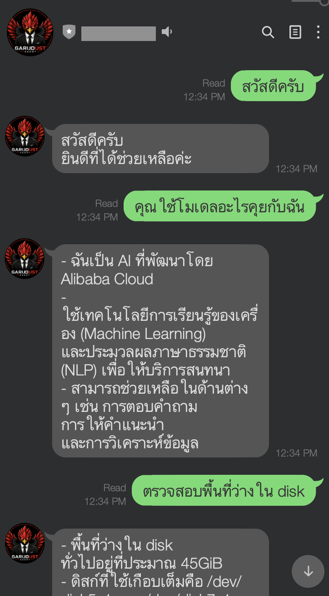

<div align="center">
  

  <a href="README.md"></a>
  <a href="docs/i18n/th/README.md"></a>
  <a href="docs/i18n/zh/README.md"></a>
</div>

# Garudust Agent

[](https://github.com/garudust-org/garudust-agent/actions/workflows/ci.yml)
[](https://crates.io/crates/garudust-agent)
[](https://crates.io/crates/garudust-agent)
[](https://github.com/garudust-org/garudust-agent/releases/latest)
[](LICENSE)

[](https://discord.com/channels/1501414298449088745/1501414298893942877)

**Your AI agent. Your server. Your rules.**

A self-improving AI agent runtime written in Rust — delivered as a single ~10 MB binary with no runtime dependencies. Chat in the terminal, reply across 7 platforms, or expose a REST + WebSocket API. Connect any MCP server, let the agent write its own reusable skills, and swap LLM providers with a single env var. No telemetry. No lock-in.

<div align="center">
  
</div>

---

## Why Garudust?

- **~10 MB binary, < 20 ms cold start** — statically linked, zero runtime dependencies
- **Self-improving** — learns your preferences, auto-generates reusable skills, corrects itself without being told twice
- **Parallel tool execution** — conflict-aware grouping runs independent tools simultaneously, serializes only when necessary
- **Credential rotation** — set `LLM_FALLBACK_API_KEYS` and the agent rotates to the next key on any auth failure, automatically
- **Smart context compression** — 3-region strategy preserves the original task and recent turns; only the middle is summarized
- **Lifecycle hooks** — `AgentHooks` callbacks for every turn, compression event, delegation, and session end
- **agentskills.io compatible** — install community skills from the hub or any GitHub repo with one command
- **7 platform adapters** — Telegram, Discord, Slack, Matrix, LINE, WhatsApp, Webhook — all in one process
- **Swap providers with one env var** — Anthropic, OpenRouter, AWS Bedrock, Ollama, vLLM, ThaiLLM, or any OpenAI-compatible endpoint
- **Secure by design** — Docker sandbox, hardline command blocks, memory-poisoning protection, automatic secret redaction

---

## Install

Download a pre-built binary from [**GitHub Releases**](https://github.com/garudust-org/garudust-agent/releases/latest) — no Rust required:

| Platform | File |
|----------|------|
| macOS Apple Silicon | `garudust-*-aarch64-apple-darwin.tar.gz` |
| macOS Intel | `garudust-*-x86_64-apple-darwin.tar.gz` |
| Linux x86_64 | `garudust-*-x86_64-unknown-linux-musl.tar.gz` |
| Linux ARM64 | `garudust-*-aarch64-unknown-linux-musl.tar.gz` |
| Windows | `garudust-*-x86_64-pc-windows-msvc.zip` |

```bash
tar -xzf garudust-*.tar.gz
sudo mv garudust garudust-server /usr/local/bin/
```

Or build from source (requires Rust 1.87+):

```bash
git clone https://github.com/garudust-org/garudust-agent
cd garudust-agent && cargo build --release
```

---

## Quick Start

```bash
garudust setup   # first-time wizard — pick provider, save API key
garudust         # interactive TUI
garudust "summarise the git log from the last 7 days"   # one-shot
```

### Run as a server

```bash
garudust-server --port 3000
```

Expose any platform by setting its token in `~/.garudust/.env` and enabling it in `~/.garudust/config.yaml`:

```yaml
platforms:
  line:
    enabled: true
    port: 3002
    webhook_path: /line
```

<div align="center">
  
</div>

---

## What's New in v0.4.0

| Feature | Detail |
|---|---|
| Parallel tool execution | Calls grouped by `parallelism_key` — independent tools run concurrently, conflicting writes serialize automatically |
| Credential rotation | `LLM_FALLBACK_API_KEYS=key2,key3` — rotates on auth failure without restarting |
| 3-region compression | Head (original task) + summarized middle + tail (recent turns) always preserved |
| `AgentHooks` trait | `on_turn_start`, `on_session_end`, `on_pre_compress`, `on_delegation` |
| Extended reasoning effort | `Minimal` (512 tokens) → `Low` → `Medium` → `High` → `XHigh` (32k tokens) |
| Sub-agent iteration budget | `sub_agent_max_iterations` caps delegation chains independently of the main agent |
| FTS5 trigram search | Substring session search — `"pythag"` matches `"Pythagorean"`, versioned DB migration included |
| WAL mode fallback | Degrades gracefully on NFS/SMB filesystems instead of crashing |

---

## Platform Adapters

<div align="center">
  <a href="https://core.telegram.org/bots"></a>
  <a href="https://discord.com/developers/applications"></a>
  <a href="https://api.slack.com/apps"></a>
  <a href="https://matrix.org"></a>
  <a href="https://developers.line.biz/console/"></a>
  <a href="https://developers.facebook.com/docs/whatsapp/cloud-api"></a>
  
</div>

All adapters run together in the same `garudust-server` process. Set the relevant token in `~/.garudust/.env` and the adapter activates automatically.

---

## LLM Providers

| Provider | `config.yaml` | `.env` |
|----------|--------------|--------|
| Anthropic | `provider: anthropic` | `ANTHROPIC_API_KEY` |
| OpenRouter | `provider: openrouter` *(default)* | `OPENROUTER_API_KEY` |
| AWS Bedrock | `provider: bedrock` | `AWS_ACCESS_KEY_ID` + `AWS_SECRET_ACCESS_KEY` |
| Ollama | `provider: ollama` + `base_url` | *(none)* |
| vLLM | `provider: vllm` + `base_url` | `VLLM_API_KEY` |
| ThaiLLM | `provider: thaillm` | `THAILLM_API_KEY` |
| Any OpenAI-compat | `provider: custom` + `base_url` | relevant key |

Fallback keys: `LLM_FALLBACK_API_KEYS=key2,key3` — rotated automatically on auth failure.

---

## Skills & Memory

The agent saves everything it learns to `~/.garudust/memory/` and loads it at the start of every session. Reusable workflows are automatically written as skills in `~/.garudust/skills/` — no manual prompting needed.

Install skills from the [agentskills.io](https://agentskills.io) hub:

```bash
garudust skill install agentskills-org/hub/git-workflow
garudust tool install weather   # community script tools
```

---

## Contributing

Adding a tool, transport, or platform adapter typically touches one crate and takes under 100 lines. See [CONTRIBUTING.md](CONTRIBUTING.md) for step-by-step guides.

Found a bug or have a question? [Open an issue](https://github.com/garudust-org/garudust-agent/issues) or join the [Discord community](https://discord.com/channels/1501414298449088745/1501414298893942877).

---

## License

MIT — see [LICENSE](LICENSE).

---

## Contributors

[](https://github.com/garudust-org/garudust-agent/graphs/contributors)

---

## Star History

[](https://star-history.com/#garudust-org/garudust-agent&Date)

---

<div align="center">
  
</div>
