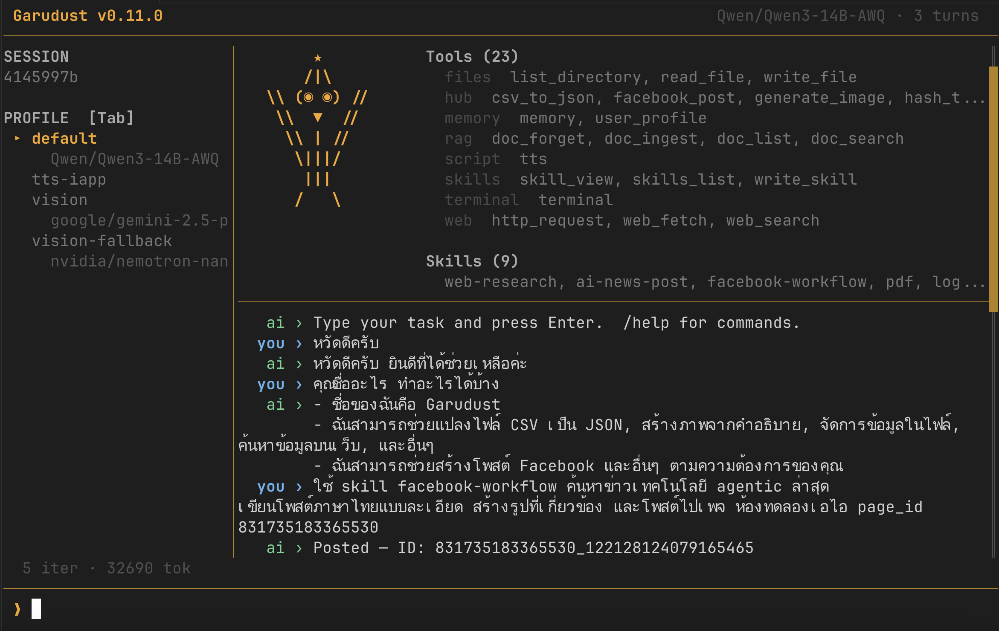

<div align="center">
  

  <a href="../../../README.md"></a>
  <a href="../th/README.md"></a>
  <a href="../zh/README.md"></a>
</div>

# Garudust Agent

[](https://github.com/garudust-org/garudust-agent/actions/workflows/ci.yml)
[](https://crates.io/crates/garudust-agent)
[](https://crates.io/crates/garudust-agent)
[](https://github.com/garudust-org/garudust-agent/releases/latest)
[](../../../LICENSE)

[](https://discord.com/channels/1501414298449088745/1501414298893942877)

**你的 AI 智能体。你的服务器。你的规则。**

基于 Rust 构建的自进化 AI 智能体运行时 — 单一 ~10 MB binary，零运行时依赖。终端聊天、跨 7 大平台回复、开放 REST + WebSocket API，三者兼得。连接任意 MCP 服务器，让智能体自动编写可复用技能，一个环境变量即可切换 LLM 提供商。无遥测，无供应商锁定。

<div align="center">
  
</div>

---

## 目录

- [为什么选择 Garudust？](#为什么选择-garudust)
- [Supported Platforms](#supported-platforms)
- [快速开始](#快速开始)
- [架构](#架构)
- [配置](#配置)
- [平台适配器](#平台适配器)
- [LLM 提供商](#llm-提供商)
- [工具](#工具)
- [RAG（文档搜索）](#rag文档搜索)
- [Hub](#hub)
- [记忆](#记忆)
- [访问控制](#访问控制)
- [安全说明](#安全说明)
- [参与贡献](#参与贡献)
- [许可证](#许可证)
- [贡献者](#贡献者)

---

## 为什么选择 Garudust？

- **~10 MB binary，冷启动 < 20 ms** — 单一静态链接文件，无任何运行时依赖
- **自我进化** — 记住你的偏好，将可复用工作流自动保存为技能，无需重复提醒
- **并行工具执行** — 基于 `parallelism_key` 分组，独立工具并发运行，仅在必要时串行化
- **自动凭证轮换** — 设置 `LLM_FALLBACK_API_KEYS`，遇到鉴权失败时自动切换下一个密钥，无需重启
- **智能上下文压缩** — 三区域策略：保留原始任务与最新轮次，仅压缩中间部分
- **生命周期钩子** — `AgentHooks` 回调覆盖每轮对话、压缩事件、委派及会话结束
- **兼容 agentskills.io** — 一条命令从社区 hub 或任意 GitHub 仓库安装技能
- **7 大平台适配器** — Telegram、Discord、Slack、Matrix、LINE、WhatsApp、Webhook，同进程运行
- **24 个 LLM 提供商，命名 profile 管理** — 支持 Anthropic、OpenAI、Gemini、Groq、Mistral、DeepSeek、xAI、Together AI、Fireworks、Cerebras、Perplexity、Cohere、NVIDIA NIM、阿里云百炼（DashScope）、字节豆包、智谱 AI、Moonshot、百度文心、OpenRouter、AWS Bedrock、Ollama、vLLM、ThaiLLM — 在 `config.yaml` 中配置命名 `providers:` profile，按任务路由
- **提供商路由 hint** — 在 config 中将 hint 名称映射到 provider/model 对；传入 `--hint fast` 即可仅针对该任务切换到更廉价的模型，不影响默认配置
- **按工具配置模型** — 通过 `config.yaml` 中的 `tools.<name>.model` 为每个 hub 工具或技能脚本指定模型（及备用模型）
- **安全优先设计** — Docker 沙箱、硬性命令拦截、内存投毒防护、工具输出自动脱敏

---

## Supported Platforms

从 [**GitHub Releases**](https://github.com/garudust-org/garudust-agent/releases/latest) 下载预构建 binary — 无需安装 Rust：

| 平台 | 文件 |
|------|------|
| macOS Apple Silicon | `garudust-*-aarch64-apple-darwin.tar.gz` |
| macOS Intel | `garudust-*-x86_64-apple-darwin.tar.gz` |
| Linux x86_64 | `garudust-*-x86_64-unknown-linux-musl.tar.gz` |
| Linux ARM64（Raspberry Pi 4/5、Jetson） | `garudust-*-aarch64-unknown-linux-musl.tar.gz` |
| Windows | `garudust-*-x86_64-pc-windows-msvc.zip` |

---

## 快速开始

**01 — 安装**

从 [GitHub Releases](https://github.com/garudust-org/garudust-agent/releases/latest) 下载预构建 binary：

```bash
# 自动检测架构（x86_64 或 ARM64 — Raspberry Pi 4/5、Jetson）
ARCH=$(uname -m)
[ "$ARCH" = "aarch64" ] && TARGET="aarch64-unknown-linux-musl" || TARGET="x86_64-unknown-linux-musl"
VER=$(curl -s https://api.github.com/repos/garudust-org/garudust-agent/releases/latest | grep tag_name | cut -d'"' -f4)
curl -LO "https://github.com/garudust-org/garudust-agent/releases/latest/download/garudust-${VER}-${TARGET}.tar.gz"
tar -xzf garudust-*.tar.gz
sudo mv garudust garudust-server /usr/local/bin/
```

或从源码构建（需 Rust 1.87+）：

```bash
git clone https://github.com/garudust-org/garudust-agent
cd garudust-agent && cargo build --release
```

---

**02 — 配置**

运行首次配置向导 — 自动选择提供商、输入 API 密钥，并将 `providers.default` profile 写入 `~/.garudust/config.yaml` 和 `~/.garudust/.env`：

```bash
garudust setup
```

或直接将密钥写入 `~/.garudust/.env`。完整 `config.yaml` 参考见[配置](#配置)章节。

---

**03 — 运行**

```bash
garudust                                     # 交互式 TUI
garudust "整理 git log 为 changelog"         # 单次任务
garudust --hint fast "这段代码正确吗？"      # 使用更廉价的模型
garudust-server --port 3000                  # 无头服务器（REST + WS）
docker compose up -d                         # Docker
```

---

### TUI 快捷键

<div align="center">
  
</div>

| 按键 | 操作 |
|------|------|
| `Enter` | 发送消息 |
| `↑ ↓` | 滚动历史 |
| `/new` | 开始新会话 |
| `/model <name>` | 即时切换模型 |
| `Ctrl+C` | 退出 |

---

## 架构

```
┌──────────────────────────────────────────────────────────────────────┐
│  bin/garudust (CLI)              bin/garudust-server (守护进程)      │
│  garudust [task] [--hint H]      garudust-server --port 3000         │
└────────────────────┬─────────────────────────┬───────────────────────┘
                     │                         │
                     │          ┌──────────────┴───────────────────────┐
                     │          │  garudust-gateway  (仅服务端)        │
                     │          │  POST /chat · POST /stream · GET /ws │
                     │          │  RBAC · roles · /join · /invite      │
                     │          │  SessionRegistry · Metrics           │
                     │          ├──────────────────────────────────────┤
                     │          │  garudust-platforms  (仅服务端)      │
                     │          │  Telegram · Discord · Slack          │
                     │          │  LINE · Matrix · WhatsApp · Webhook  │
                     │          ├──────────────────────────────────────┤
                     │          │  garudust-cron  (仅服务端)           │
                     │          │  cron 定时自主任务                   │
                     │          └──────────────┬───────────────────────┘
                     │                         │
                     ▼                         ▼
┌──────────────────────────────────────────────────────────────────────┐
│                    garudust-agent  (运行循环)                        │
│                                                                      │
│  1. 加载 memory.md + user_profile.md                                │
│  2. 构建 system prompt — 注入 skills 提示                           │
│  3. 解析路由 hint → transport + model                               │
│                                                                      │
│  LOOP (max_iterations = 90):                                         │
│    a. LLM 调用（流式）→ 获取 text + tool_calls                      │
│    b. 验证 schema → 检查权限 → approval gate                        │
│    c. 执行工具（安全时并行，含超时控制）                            │
│    d. 包装不可信输出 → 追加结果到历史                              │
│    e. stop_reason == EndTurn → 退出循环                             │
│                                                                      │
│  4. 保存对话 → ~/.garudust/conversations/{hash}.json                │
│  5. 持久化日志 → SessionDb（SQLite）                                │
└──────┬──────────────┬─────────────────┬─────────────────────────────┘
       │              │                 │
       ▼              ▼                 ▼
┌────────────┐ ┌────────────┐ ┌──────────────┐
│ garudust-  │ │ garudust-  │ │  garudust-   │
│ transport  │ │ tools      │ │  memory      │
│            │ │            │ │              │
│ 24 个 LLM  │ │ 内置工具   │ │ memory.md    │
│ 提供商     │ │ Hub/脚本   │ │ user_profile │
│ 命名       │ │ MCP        │ │ sessions.db  │
│ profiles   │ │            │ │ docs.db(RAG) │
│ 重试 +     │ │            │ │              │
│ 密钥轮换   │ │            │ │              │
└────────────┘ └────────────┘ └──────────────┘

garudust-core — 共享类型 · 配置 · 特征 · 定价（被以上所有 crate 使用）
```

**Gateway** — `garudust-gateway` 通过 axum 将智能体暴露为 HTTP/WebSocket/SSE 服务（`/chat`、`/stream`、`/ws`、`/health`、`/metrics`）。`GatewayHandler` 位于平台与智能体之间：负责强制执行 RBAC、解析每位用户的审批器、管理会话，并处理运行时命令（`/join`、`/invite`、`/role`、`/whoami`）。仅供服务端使用。

**Platforms** — `garudust-platforms` 为各消息服务（Telegram、Discord、Slack、LINE、Matrix、WhatsApp、Webhook）提供 `PlatformAdapter` 实现。仅供服务端使用，CLI 无平台层。

**Cron** — `garudust-cron` 按 cron 时间表运行智能体任务（格式：`"0 9 * * *=早间简报"`）。由服务端使用，用于无需人工介入的自主定时运行。

**Transport** — `garudust-transport` 将 `providers.default`（或命名 profile）解析为对应的 API 客户端：原生 Anthropic SDK、OpenAI 兼容 HTTP、Bedrock 或 Ollama。所有客户端均封装了指数退避重试和自动凭证轮换机制。

**Tools** — 三种类型：*内置工具*（files、terminal、browser、web、memory、git、rag、delegate、cron、notes）、*hub/脚本工具*（下载至 `~/.garudust/tools/`，支持任意语言）和 *MCP*（任意 Model Context Protocol 服务器）。所有工具共享同一调度路径：schema 验证 → 权限检查 → approval gate → 超时执行。

**Memory** — `FileMemoryStore` 将 `memory.md` 和 `user_profile.md` 写入磁盘（Markdown 格式）；`SessionDb` 将对话历史和工具调用日志持久化到 SQLite；`DocStore` 基于 FTS5 为 RAG 文档提供全文搜索能力。

**Skills** — Markdown 指令文件（`~/.garudust/skills/*.md`），以提示的形式注入 system prompt。`skill_view` 加载技能的完整内容，并在当次对话中强制执行其声明的 `required_tools` 和 `permissions`。达到 `auto_skill_threshold` 次迭代后，可复用技能将被自动生成并写入磁盘。

**Routing** — `--hint <name>` 映射到 `config.yaml` 的 `routing:` 条目（格式为 `"profile/model"` 或 `"provider/model"`），仅针对当前任务切换 transport 和 model，不影响默认配置。

---

## 配置

密钥存放在 `~/.garudust/.env`，其余配置放在 `~/.garudust/config.yaml`。运行 `garudust setup` 可交互式生成两个文件。

### `~/.garudust/.env`

```bash
# LLM 提供商 — 设置一个（无 config.yaml 时自动从环境变量检测）
ANTHROPIC_API_KEY=sk-ant-...
# OPENAI_API_KEY=sk-...
# GEMINI_API_KEY=AIza...
# GROQ_API_KEY=gsk_...
# MISTRAL_API_KEY=...
# DEEPSEEK_API_KEY=sk-...
# XAI_API_KEY=xai-...
# OPENROUTER_API_KEY=sk-or-...
# VLLM_API_KEY=...

# 备用密钥 — 鉴权失败时自动轮换
# LLM_FALLBACK_API_KEYS=sk-ant-backup1,sk-ant-backup2

# 平台适配器 — 仅设置需要使用的
TELEGRAM_TOKEN=123456789:AAFxxx
DISCORD_TOKEN=<bot-token>
SLACK_BOT_TOKEN=xoxb-...
SLACK_APP_TOKEN=xapp-...
LINE_CHANNEL_TOKEN=<channel-access-token>
LINE_CHANNEL_SECRET=<32位十六进制密钥>
WHATSAPP_ACCESS_TOKEN=EAAxxxxx
WHATSAPP_PHONE_NUMBER_ID=123456789012345
WHATSAPP_VERIFY_TOKEN=my_verify_token

# 搜索工具
BRAVE_SEARCH_API_KEY=BSA...      # 可选 — 未设置时回退到 DuckDuckGo
SERPER_API_KEY=...               # 可选 — 通过 Serper 使用 Google 搜索

# 网关安全
GARUDUST_API_KEY=my-gateway-secret
```

### `~/.garudust/config.yaml`

```yaml
# ── 提供商 profile ────────────────────────────────────────────────────────────
# providers.default 设置主 LLM。API 密钥保存在 ~/.garudust/.env。
providers:
  default:
    name: anthropic          # anthropic | openai | gemini | groq | mistral | deepseek
                             # xai | openrouter | ollama | vllm | thaillm | bedrock
                             # together | fireworks | cerebras | perplexity | cohere
                             # nvidia | alibaba | doubao | zhipu | moonshot | baidu
    key: ${ANTHROPIC_API_KEY}
    model: claude-sonnet-4-6

  # 用于路由或按工具指定模型的额外命名 profile：
  # groq-fast:
  #   name: groq
  #   key: ${GROQ_API_KEY}
  #   model: llama-3.1-8b-instant
  #
  # local:
  #   url: http://localhost:11434/v1   # 自定义 OpenAI 兼容端点
  #   model: llama3.2

# ── 智能体设置 ────────────────────────────────────────────────────────────────
max_iterations: 90
max_output_tokens: 8192
context_window: 128000      # 小上下文模型请调低（如 32768）
reasoning_effort: ~         # low | medium | high（Claude 扩展思考 / OpenAI o-series）
show_usage_footer: false

# ── 超时与重试 ────────────────────────────────────────────────────────────────
llm_timeout_secs: 120
tool_timeout_secs: 60
llm_max_retries: 3

# ── 提供商路由 hint（按任务切换模型）────────────────────────────────────────
# 在 CLI 传入 --hint <name>，或在 API payload 中设置 hint: "name"。
# 格式：`"profile/model"`（使用命名 profile）或 `"provider/model"`（内置提供商）。
routing:
  fast:   groq-fast/llama-3.1-8b-instant   # 使用上方定义的 groq-fast profile
  vision: openai/gpt-4o                     # 内置提供商名称
  smart:  anthropic/claude-opus-4-7

# ── 按工具配置模型 ────────────────────────────────────────────────────────────
# 以 GARUDUST_MODEL / GARUDUST_FALLBACK_MODEL 环境变量形式传递给工具子进程。
# 不读取这些变量的工具不受影响（完全向后兼容）。
tools:
  view_image:
    model: openrouter/google/gemini-flash-1.5
    fallback_model: google/gemini-1.5-flash

# ── 禁用工具 / 工具集 ─────────────────────────────────────────────────────────
# disabled_toolsets: [browser, git, notes]
# disabled_tools: [image_read, pdf_read]

# ── 安全 ──────────────────────────────────────────────────────────────────────
security:
  approval_mode: smart        # auto | smart | deny
                              # smart = 审计高风险工具调用但不拦截
                              # 使用 deny 可拦截所有未明确授权的工具调用
  terminal_sandbox: none      # none | docker
                              # 警告：none 直接在宿主机上执行 shell 命令
                              # 生产环境建议使用 docker 以隔离命令执行
  rate_limit_rpm: ~           # 每 IP 每分钟请求限制（~ = 不限）
  allowed_read_paths: []      # 默认：cwd + home
  allowed_write_paths: []     # 默认：cwd

# ── 子智能体委派 ───────────────────────────────────────────────────────────────
# max_delegation_depth: 1     # delegate_task 最大递归深度（默认 1）
                              # 0 = 子智能体不可继续委派
                              # 防止无限递归委派链

# ── 记忆过期 ──────────────────────────────────────────────────────────────────
memory_expiry:
  fact_days: 90               # null = 永不过期
  project_days: 30
  other_days: 60
  preference_days: ~
nudge_interval: 5             # 每 N 轮工具调用后提醒保存记忆（0 = 关闭）
auto_skill_threshold: 5       # 达到 N 次迭代后自动写入技能（0 = 关闭）

# ── 平台 / 群聊控制 ───────────────────────────────────────────────────────────
platform:
  require_mention: false      # true = 仅在群组中被 @提及时才响应
  bot_username: ""
  session_per_user: true

# ── Webhook 平台 ──────────────────────────────────────────────────────────────
platforms:
  webhook:
    enabled: true
    port: 3001
    webhook_path: /webhook
  line:
    enabled: false
    port: 3002
    webhook_path: /line
  whatsapp:
    enabled: false
    port: 3003
    webhook_path: /whatsapp

# ── HTTP 网关 ─────────────────────────────────────────────────────────────────
server:
  port: 3000

# ── 定时任务 ──────────────────────────────────────────────────────────────────
cron:
  memory_consolidation: "0 3 * * *"   # 每晚自动整理记忆
  memory_expiry: "0 4 * * 0"          # 每周清理过期记忆
  jobs:
    - schedule: "0 9 * * 1-5"
      task: "生成每日简报并保存到 ~/briefing.md"

# ── 上下文压缩 ────────────────────────────────────────────────────────────────
compression:
  enabled: true
  threshold_fraction: 0.8     # 上下文窗口使用达 80% 时触发压缩
  model: ~                    # 独立压缩模型（默认使用主模型）

# ── 网络 ──────────────────────────────────────────────────────────────────────
network:
  force_ipv4: false
  proxy: ~                    # http://proxy:8080

# ── MCP 服务器 ────────────────────────────────────────────────────────────────
mcp_servers:
  - name: filesystem
    command: npx
    args: ["-y", "@modelcontextprotocol/server-filesystem", "/tmp"]
```

---

## 平台适配器

<div align="center">
  <a href="https://core.telegram.org/bots"></a>
  <a href="https://discord.com/developers/applications"></a>
  <a href="https://api.slack.com/apps"></a>
  <a href="https://matrix.org"></a>
  <a href="https://developers.line.biz/console/"></a>
  <a href="https://developers.facebook.com/docs/whatsapp/cloud-api"></a>
  
</div>

所有适配器在同一 `garudust-server` 进程中运行。在 `~/.garudust/.env` 中设置对应 token 即可自动激活。

---

## LLM 提供商

在 `config.yaml` 中设置 `providers.default.name`，并在 `~/.garudust/.env` 中填写对应密钥：

| 提供商 | `providers.default.name` | `.env` |
|--------|--------------------------|--------|
| Anthropic | `anthropic` | `ANTHROPIC_API_KEY` |
| OpenAI | `openai` | `OPENAI_API_KEY` |
| Google Gemini | `gemini` | `GEMINI_API_KEY` |
| Groq | `groq` | `GROQ_API_KEY` |
| Mistral | `mistral` | `MISTRAL_API_KEY` |
| DeepSeek | `deepseek` | `DEEPSEEK_API_KEY` |
| xAI (Grok) | `xai` | `XAI_API_KEY` |
| OpenRouter | `openrouter` | `OPENROUTER_API_KEY` |
| AWS Bedrock | `bedrock` | `AWS_ACCESS_KEY_ID` + `AWS_SECRET_ACCESS_KEY` |
| Ollama | `ollama` *（自定义端点请添加 `url:`）* | *（无需）* |
| vLLM | `vllm` *（自定义端点请添加 `url:`）* | `VLLM_API_KEY` |
| ThaiLLM | `thaillm` | `THAILLM_API_KEY` |
| Together AI | `together` | `TOGETHER_API_KEY` |
| Fireworks AI | `fireworks` | `FIREWORKS_API_KEY` |
| Cerebras | `cerebras` | `CEREBRAS_API_KEY` |
| Perplexity | `perplexity` | `PERPLEXITY_API_KEY` |
| Cohere | `cohere` | `COHERE_API_KEY` |
| NVIDIA NIM | `nvidia` | `NVIDIA_API_KEY` |
| 阿里云百炼（DashScope） | `alibaba` | `DASHSCOPE_API_KEY` |
| 字节豆包 | `doubao` | `ARK_API_KEY` |
| 智谱 AI（GLM） | `zhipu` | `ZHIPU_API_KEY` |
| Moonshot（Kimi） | `moonshot` | `MOONSHOT_API_KEY` |
| 百度文心 | `baidu` | `QIANFAN_API_KEY` |
| 任意 OpenAI 兼容 | *（省略 `name:`，在 profile 中设置 `url:`）* | 对应 API 密钥 |

备用密钥：`LLM_FALLBACK_API_KEYS=key2,key3` — 鉴权失败时自动轮换

---

## 工具

内置工具开箱即用，无需任何配置。

| 工具 | 说明 |
|------|------|
| `web_fetch` | 抓取 URL 内容 |
| `web_search` | 网页搜索（Brave / Serper / DuckDuckGo） |
| `http_request` | 自定义 HTTP 请求，支持自定义 headers 和 body |
| `browser` | 通过 CDP 控制 Chrome/Chromium — 点击、输入、截图、执行 JS |
| `read_file` / `write_file` | 文件读写 |
| `list_directory` | 支持 glob 模式和深度限制的目录列表 |
| `terminal` | 执行 shell 命令（可选 Docker 沙箱隔离 — 请参阅安全说明） |
| `memory` | 跨会话持久化键值存储 |
| `session_search` | 全文搜索历史对话（FTS5 trigram） |
| `delegate_task` | 并行派生子智能体处理分解任务（深度受 `max_delegation_depth` 限制） |
| `skill_view` / `write_skill` | 加载和编写可复用技能 |
| `doc_ingest` | 将文档（PDF、TXT、CSV、MD 等）建立全文索引 |
| `doc_search` | 在所有已建索引的文档中全文搜索 |
| `doc_list` | 列出当前会话中所有已建索引的文档 |
| `doc_forget` | 从 RAG 索引中移除一个或全部文档 |

**自定义脚本工具** — 在 `~/.garudust/tools/<name>/` 中放置 `tool.yaml` 和脚本：

```yaml
# tool.yaml
name: get_weather
description: 获取城市当前天气
schema:
  type: object
  properties:
    city: { type: string }
  required: [city]
command: "curl -s wttr.in/{city}?format=3"
# env_required: [MY_API_KEY]   # 仅将指定密钥从 ~/.garudust/.env 转发给脚本
```

通过 `config.yaml` 为每个工具指定模型。`model` 和 `fallback_model` 均支持 `"profile/model"`（`providers:` 中的命名 profile）或 `"provider/model"`（内置提供商）。子进程将收到主模型的 `GARUDUST_MODEL` / `GARUDUST_BASE_URL` / `GARUDUST_API_KEY`，以及备用模型的 `GARUDUST_FALLBACK_MODEL` / `GARUDUST_FALLBACK_BASE_URL` / `GARUDUST_FALLBACK_API_KEY`：

```yaml
tools:
  get_weather:
    model: groq-fast/llama-3.1-8b-instant        # "groq-fast" = 命名 profile
    fallback_model: openrouter/meta-llama/llama-3.1-8b-instruct  # 内置提供商
  view_image:
    model: vision/gemini-flash-latest             # "vision" = 命名 profile（如 gemini 密钥）
    fallback_model: vision-fallback/nvidia/nemotron-nano-12b-v2-vl:free
```

**MCP** — 在 `config.yaml` 中接入任意 [Model Context Protocol](https://modelcontextprotocol.io) 服务器：

```yaml
mcp_servers:
  - name: filesystem
    command: npx
    args: ["-y", "@modelcontextprotocol/server-filesystem", "/tmp"]
```

---

## RAG（文档搜索）

为文档建立索引后直接提问 — 智能体会在相关时自动搜索。

**支持格式：** PDF、TXT、CSV、MD、JSON、DOCX、DOC、XLSX、XLS

**通过聊天平台** — 发送文件，确认机器人的询问，然后自然提问即可。

**通过 CLI** — 输入：`索引 /home/user/report.pdf`

智能体自动调用 `doc_search`，用 `doc_list` 查看已索引文件，用 `doc_forget` 删除。各会话的索引相互隔离。

在 `config.yaml` 中禁用：

```yaml
disabled_toolsets: ["rag"]
```

---

## Hub

一条命令，即可用社区工具和技能扩展智能体能力。

**Tool Hub**（[garudust-hub](https://github.com/garudust-org/garudust-hub)）

```bash
garudust tool list                        # 浏览可用工具
garudust tool install weather             # 下载到 ~/.garudust/tools/weather/
garudust tool install hash_text
garudust tool uninstall weather
garudust tool update                      # 更新所有 hub 工具
```

**Skills Hub**（[agentskills.io](https://agentskills.io)）

```bash
garudust skill list
garudust skill install agentskills-org/hub/git-workflow
garudust skill install https://example.com/skills/my-skill/SKILL.md
garudust skill uninstall git-workflow
```

---

## 记忆

智能体将所学内容保存至 `~/.garudust/memory/`，并在每次会话开始时自动加载 — 无需重复说明。可复用的工作流会被自动写入 `~/.garudust/skills/`，无需任何手动操作。

```
你：JSON 始终使用 2 个空格缩进
Agent：已记录。
# 下次会话：直接应用，无需再次提醒
```

---

## 访问控制

Garudust 通过 `config.yaml` 中的 `roles:` 支持基于角色的访问控制（RBAC）。
每个用户被分配一个角色；角色决定了他们可以运行哪些工具以及工具如何被审批。

### 角色定义

| 字段 | 可选值 | 说明 |
|---|---|---|
| `approval_mode` | `auto` / `smart` / `deny` | 该角色的工具调用审批方式 |
| `allowed_toolsets` | 工具集名称列表 | 限制为这些工具集（为空 = 不限制） |
| `allowed_tools` | 工具名称列表 | 额外允许的单个工具 |
| `denied_tools` | 工具名称列表 | 始终被阻止的工具，无论工具集如何设置 |

`approval_mode` 的值：

- **`auto`** — 每次工具调用立即通过
- **`smart`** — 通过宪法策略审计调用（全局默认行为）
- **`deny`** — 所有工具调用被阻止；机器人仍可正常回复消息

### 用户分配

用户通过平台和 ID 在 `roles.users` 下进行映射。
Telegram 同时支持数字 ID 和 `@username`。
未找到映射的用户将使用 `default_role`；若未设置 `default_role`，则应用全局 `security.approval_mode`。

### 自举（Bootstrap）

当 `roles:` 已配置 `admin` 角色定义但尚未分配任何用户时，
**第一个发送私信的人**会被自动提升为 `admin`。
这意味着你可以以空的 `roles.users` 部署，并在首次联系时声明所有权——
无需事先查找平台 ID 并手动编辑 `config.yaml`。

### 未知用户拦截

当角色系统启用，且传入用户没有分配角色且没有适用的 `default_role` 时，
智能体不会静默忽略该用户，而是回复说明访问受限，
并告知他们输入 `/join` 来申请访问权限。

### 自助注册流程

新用户获得访问权限有两种方式：

- **`/join`（无码）** — 向同一平台上的每位管理员发送通知。
  通知中包含预构建的 `/role approve <platform:id> <role>` 命令，管理员直接回复即可授予访问权限。
- **`/join <code>`** — 使用邀请码立即分配角色，无需管理员在线操作。

### 邀请码

管理员通过 `/invite <role> [max_uses]` 生成邀请码。
默认情况下，邀请码仅限使用一次，24 小时后过期。
邀请码可通过带外渠道共享（如 LINE 群、邮件或任何其他渠道），
无论接收者通过哪个平台兑换均有效。

### 运行时命令

| 命令 | 适用用户 | 说明 |
|---|---|---|
| `/whoami` | 所有人 | 显示你当前的平台 ID 和角色 |
| `/join` | 未注册用户 | 申请访问——通知管理员并附带预构建的审批命令 |
| `/join <code>` | 未注册用户 | 使用邀请码立即分配角色 |
| `/role list` | 管理员 | 列出当前平台上所有已分配角色的用户 |
| `/role add <platform:id> <role>` | 管理员 | 直接分配角色 |
| `/role approve <platform:id> <role>` | 管理员 | 分配角色并通知用户 |
| `/role remove <platform:id>` | 管理员 | 移除用户角色 |
| `/role deny <platform:id>` | 管理员 | 撤销访问权限（同 remove） |
| `/invite <role> [max_uses]` | 管理员 | 生成可共享的邀请码（默认 1 次使用，24 小时有效） |

---

## 安全说明

### Terminal 工具

`terminal_sandbox: none`（默认值）直接在**宿主机 OS** 上执行 shell 命令——智能体选择运行的任何命令都将具有与服务器进程相同的权限。

- **开发 / 本地 CLI 用途：** 默认值可接受。
- **生产 / 多用户部署：** 设置 `terminal_sandbox: docker` 以将命令执行隔离在 Docker 容器中，或完全禁用该工具：

```yaml
security:
  terminal_sandbox: docker   # 生产环境推荐

# 或完全禁用该工具：
disabled_tools: [terminal]
```

`approval_mode: smart` 会审计并记录潜在高风险的工具调用，但**不会拦截**执行。若需拦截：

```yaml
security:
  approval_mode: deny        # 拦截所有未授权的工具调用
```

### delegate_task 递归

`delegate_task` 会派生子智能体。若无深度限制，恶意或配置错误的提示词可能触发无限递归委派。默认 `max_delegation_depth: 1` 表示子智能体最多可再派生一层。设置为 `0` 可完全禁止子智能体委派：

```yaml
max_delegation_depth: 0   # 子智能体不可继续委派子智能体
```

---

## 参与贡献

Welcome, garudian！Garudust 由一群相信 AI 智能体应该快速、私密、受用户掌控的人共同构建。每一份贡献——无论是修复拼写错误、添加新工具还是实现完整特性——都让它变得更好。

### 贡献方式

| 方向 | 具体内容 | 难度 |
|------|---------|------|
| Bug 报告 | 提交 issue 并附上复现步骤 | 极低 |
| 文档 | 修复错别字、改进示例、翻译 | 低 |
| Hub 工具 | 向 [garudust-hub](https://github.com/garudust-org/garudust-hub) 添加脚本工具 | 低 |
| 技能 | 编写可复用技能并分享到 [agentskills.io](https://agentskills.io) | 低 |
| 平台适配器 | 在 `garudust-platforms` 中添加新聊天平台支持 | 中等 |
| 传输提供商 | 在 `garudust-transport` 中添加新 LLM 提供商 | 中等 |
| 核心功能 | 智能体循环、记忆、压缩、工具 | 较高 |

### 快速开始

```bash
git clone https://github.com/garudust-org/garudust-agent
cd garudust-agent
cargo build                   # 构建所有 crate
cargo test --workspace        # 运行完整测试套件
cargo clippy --workspace      # lint 检查
```

**添加内置工具** — 在 `crates/garudust-tools/src/toolsets/` 中实现 `Tool` trait，并在 `ToolRegistry::new()` 中注册。通常只需一个文件，不超过 100 行。

**添加 hub 工具** — 在 [garudust-hub](https://github.com/garudust-org/garudust-hub) 的 `tools/<name>/` 下放置 `tool.yaml` 和脚本，无需 Rust。

**添加 LLM 提供商** — 在 `crates/garudust-transport/src/` 中实现 `ProviderTransport`（`chat` + `chat_stream`），并在 `registry.rs` 中接入。

**添加平台适配器** — 在 `crates/garudust-platforms/src/` 中实现 `PlatformAdapter`（`send_message` + `start_listening`）。

详细分步指南请参见 [CONTRIBUTING.md](../../../CONTRIBUTING.md)。

### 社区

- [Discord](https://discord.com/channels/1501414298449088745/1501414298893942877) — 交流、提问与分享想法
- [Issues](https://github.com/garudust-org/garudust-agent/issues) — Bug 报告与功能请求
- [Discussions](https://github.com/garudust-org/garudust-agent/discussions) — 长篇提案与深度讨论
- [dev.to/garudust](https://dev.to/garudust) — 文章与教程

---

## 许可证

MIT — 详见 [LICENSE](../../../LICENSE)

---

## 贡献者

[](https://github.com/garudust-org/garudust-agent/graphs/contributors)

---

<div align="center">
  
</div>
